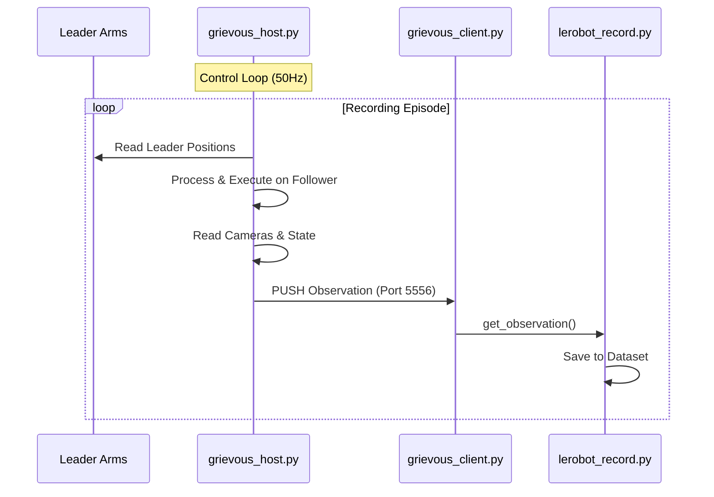
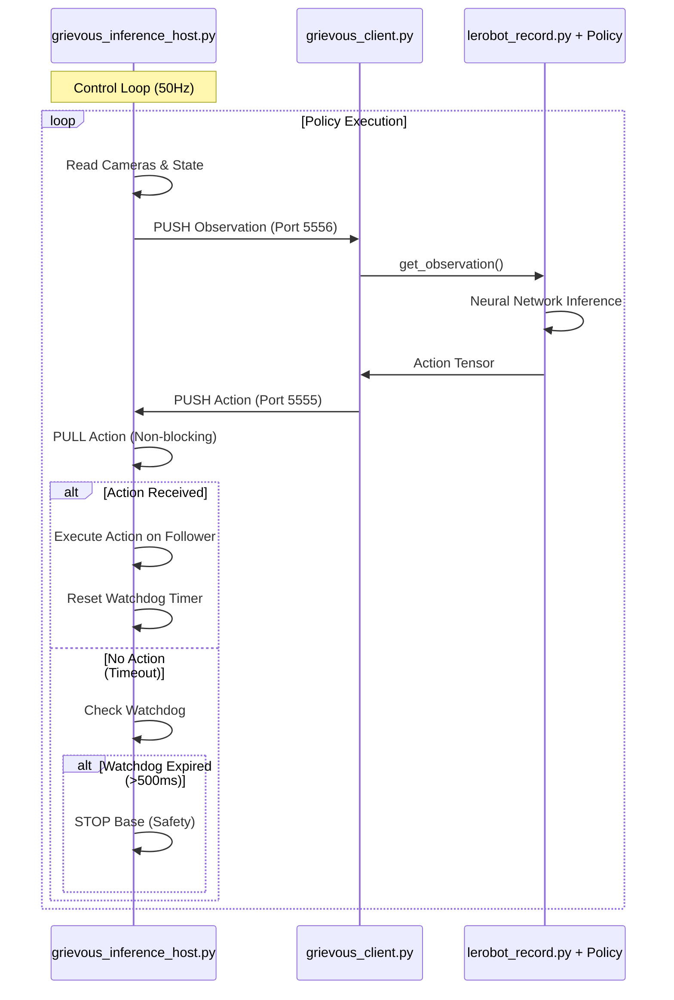

# Remote Inference Architecture

## Objective
Enable **Remote Policy Inference** where the Policy runs on a high-performance server (e.g., RunPod GPU) while the Robot hardware runs on a local host (RPi5/Laptop). The implementation follows the proven `xlerobot` pattern: simple, bidirectional communication with watchdog safety. **Recording mode remains completely untouched** by using a separate host script.

## Architecture Overview

### Two Separate Host Scripts

1. **`grievous_host.py`** (Existing - Recording Mode)
   - **Purpose:** Dataset recording with Leader Arm teleoperation
   - **Components:** Leader Arms + Follower Arms + Cameras
   - **Control Source:** Leader Arms (local teleop)
   - **Socket Configuration:**
     - Observation: `PUSH` (Host) → `PULL` (Client)
     - Command: `PUSH` (Host) → `PUSH` (Client) - Currently ignored by client

2. **`grievous_inference_host.py`** (New - Inference Mode)
   - **Purpose:** Remote policy control with future leader arm overwrite capability
   - **Components:** `Grievous` robot (includes both follower and leader arms, but leader arms are not actively read initially)
   - **Control Source:** Network commands from remote policy (leader arms available for future overwrite feature)
   - **Socket Configuration:**
     - Observation: `PUSH` (Host) → `PULL` (Client) - Same as recording
     - Command: `PULL` (Host) ← `PUSH` (Client) - Receives policy actions

### Unified Client

**`grievous_client.py`** (Modified - Works for Both Modes)
- **Change Required:** Uncomment `send_action` ZMQ transmission (Line 478)
- **Recording Mode:** `send_action` is called but Host ignores it (socket mismatch)
- **Inference Mode:** `send_action` transmits policy actions to Host

## Socket Architecture

| Socket Type | Port | Recording Mode | Inference Mode |
|:------------|:-----|:---------------|:---------------|
| **Observation** | 5556 | Host `PUSH` → Client `PULL` | Host `PUSH` → Client `PULL` |
| **Command** | 5555 | Host `PUSH` → Client `PUSH` (ignored) | Host `PULL` ← Client `PUSH` |

## Implementation Changes

### 1. `src/lerobot/robots/grievous/grievous_client.py`
- **Line 478:** Uncomment `self.zmq_cmd_socket.send_string(json.dumps(action), flags=zmq.NOBLOCK)`
- **Result:** Enables action transmission for inference mode. No impact on recording (Host doesn't listen).

### 2. `src/lerobot/robots/grievous/grievous_inference_host.py` (New File)
- **Based on:** `xlerobot_host.py` pattern (control loop structure)
- **Robot Component:** `Grievous` robot class (includes follower + leader arms, but leader arms not actively used initially)
- **Command Socket:** `zmq.PULL` (receives actions from network)
- **Observation Socket:** `zmq.PUSH` (sends state/images to network)
- **Control Loop:**
  1. Try to receive network action (non-blocking)
  2. If received: Execute action + Reset watchdog timer
  3. If timeout: Check watchdog → Stop base if >500ms elapsed
  4. Read cameras and state (from follower only)
  5. Encode images to base64
  6. Send observation to network
  7. Rate limit to target frequency (e.g., 50Hz)
- **Future Enhancement:** Leader arm monitoring and overwrite logic can be added later without changing robot instantiation

### 3. `src/lerobot/robots/grievous/grievous_host.py`
- **No changes required** - Recording mode preserved

## Data Flow Diagrams

### Recording Mode (Unchanged)

### Inference Mode (New)

## Critical Considerations

1. **Latency:** Round-trip (Obs → GPU → Action) must be < 100ms target. Higher latency causes stuttering or watchdog timeouts.
2. **Watchdog Timeout:** 500ms default. Tune based on network conditions and inference speed.
3. **Termination:** User terminates `lerobot_record.py` → Host detects timeout → Robot stops safely (base motors).
4. **Backward Compatibility:** Recording mode completely unaffected. Uses separate host script.
5. **Future Extensibility:** Using `Grievous` class enables future leader arm overwrite feature without refactoring robot instantiation.

